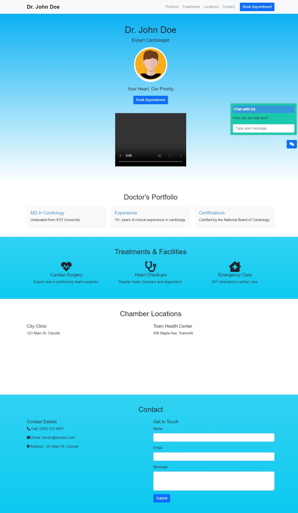

# Doctor's Landing Page 🩺

A professionally designed landing page for showcasing a doctor's portfolio, services, and contact details. Built using HTML, CSS, and JavaScript, this responsive webpage is ideal for creating an online presence for healthcare professionals.



[Live Demo](https://muaz64.github.io/Demo-landing-page-for-a-Doctor-/)

---

## Description

This landing page serves as a one-stop destination for patients to learn more about a doctor, their qualifications, services offered, and how to book appointments. It is designed to be clean, intuitive, and user-friendly, ensuring a great experience on both desktop and mobile devices.

---

## Interesting Techniques

### JavaScript Techniques
1. **Interactive Chat Widget**:
   - Implements a live chat-like widget for user queries, encouraging direct communication.

2. **Smooth Scroll**:
   - Allows users to navigate smoothly between sections using JavaScript scrolling behavior.
   - [MDN Reference: Element.scrollIntoView](https://developer.mozilla.org/en-US/docs/Web/API/Element/scrollIntoView)

3. **Dynamic Form Validation**:
   - Ensures users fill out required fields before submitting the contact form, enhancing user experience.

### CSS Techniques
1. **Gradient Background**:
   - Utilizes CSS gradients to create an appealing blue-to-light-blue background effect.
   - [MDN Reference: CSS Gradients](https://developer.mozilla.org/en-US/docs/Web/CSS/gradient)

2. **Responsive Design**:
   - Leverages Flexbox and media queries to ensure the page layout adjusts seamlessly across different screen sizes.
   - [MDN Reference: CSS Flexbox](https://developer.mozilla.org/en-US/docs/Web/CSS/CSS_Flexible_Box_Layout/Basic_Concepts_of_Flexbox)

3. **Card Layouts**:
   - Uses CSS cards to showcase the doctor’s portfolio, treatments, and locations in an organized manner.

---

## Non-Obvious Technologies and Libraries

1. **Google Fonts**:
   - Fonts Used: [Poppins](https://fonts.google.com/specimen/Poppins) for headings and [Roboto](https://fonts.google.com/specimen/Roboto) for body text.
   - Integration:
     ```html
     <link href="https://fonts.googleapis.com/css2?family=Poppins:wght@400;600&family=Roboto:wght@300&display=swap" rel="stylesheet">
     ```

2. **Font Awesome Icons**:
   - Used to include icons for phone, email, and location details.
   - [Font Awesome Link](https://fontawesome.com/)

---

## Project Structure

```plaintext
/
├── index.html        # Main HTML file for the landing page
├── style.css         # CSS file for styling the page
├── script.js         # JavaScript file for interactivity
├── assets/           # Directory for images and icons
```

### Notable Directories
- **assets/**: Contains images for the doctor’s profile, service icons, and background visuals.
- **fonts/**: Hosts any locally downloaded font files; primarily uses Google Fonts via CDN.

---

## Features

1. **Doctor's Profile**:
   - Highlights the doctor’s name, specialization, and credentials with a professional photo and tagline.

2. **Portfolio Section**:
   - Displays the doctor's qualifications, years of experience, and certifications.

3. **Treatments & Facilities**:
   - Details the services offered, such as cardiac surgery, heart checkups, and emergency care.

4. **Clinic Locations**:
   - Lists all available chambers with addresses for easier navigation.

5. **Contact Section**:
   - Includes a responsive contact form for users to get in touch.

6. **Chat Widget**:
   - A built-in interactive chat option for answering user queries.

---

Feel free to explore the [repository](https://github.com/muaz64/Demo-landing-page-for-a-Doctor-) to learn more about the project or customize it to fit your requirements!

---